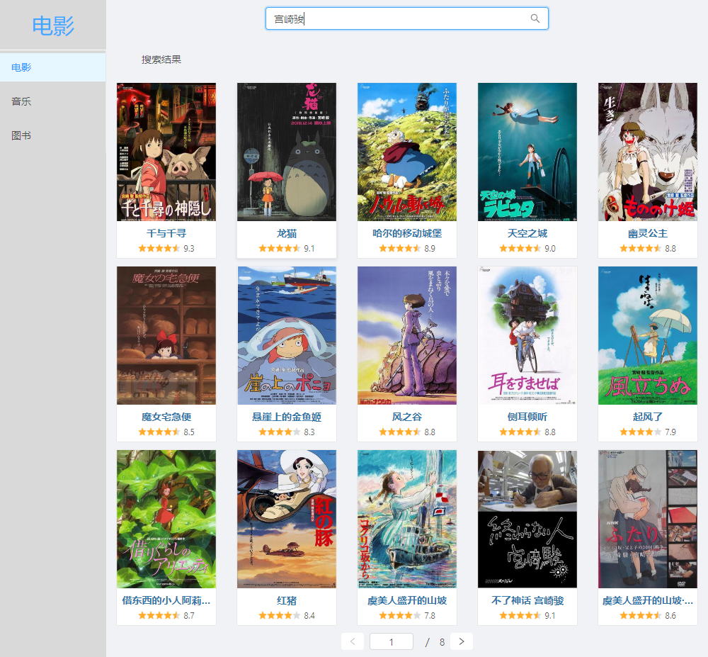
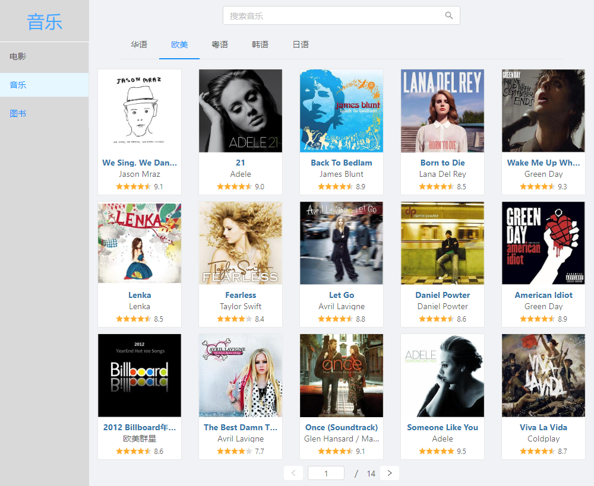
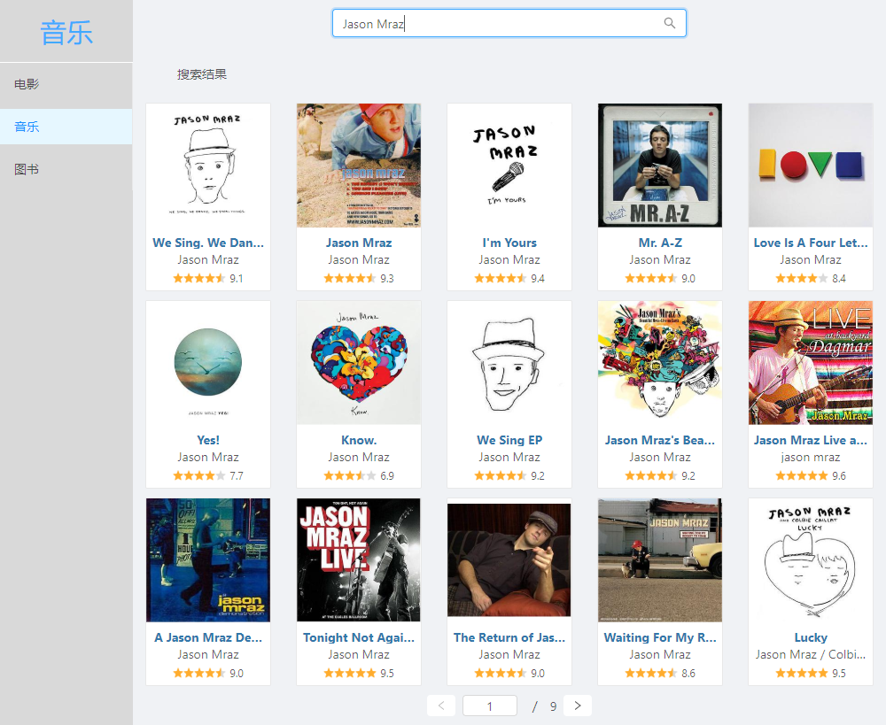
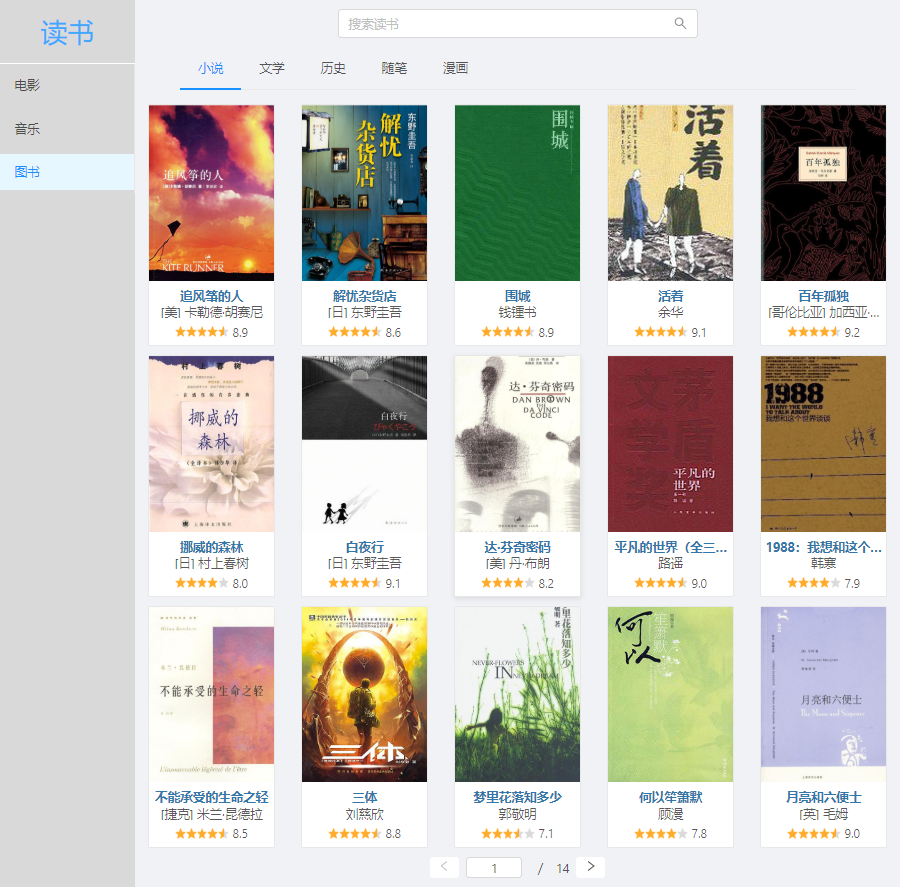
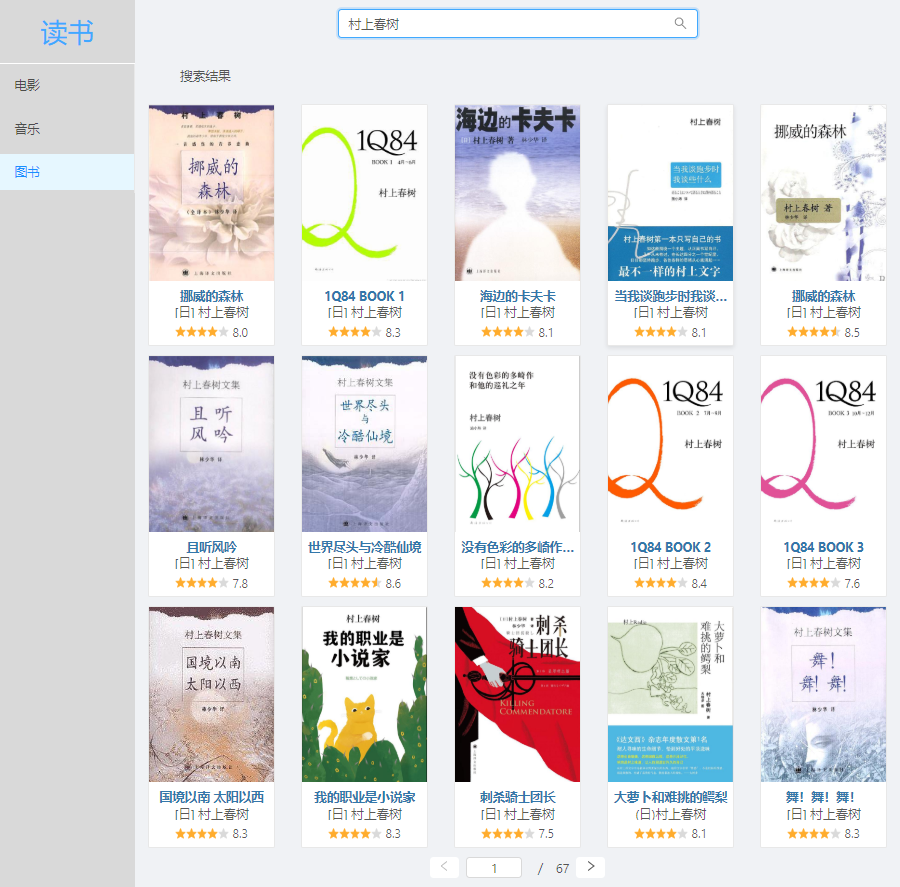

使用 antd 完成显示电影、音乐和图书页面，在搜索栏中输入关键字可搜索相对应的内容，数据来自豆瓣提供的 API。<br>

使用方法：
```
yarn start
```
然后访问 `http://localhost:3000`。

### 1.电影页面

电影显示页面：
<div style="margin: 10px 0"></div>
电影搜索页面：
<div style="margin: 10px 0"></div>

### 2.音乐页面

音乐显示页面：
<div style="margin: 10px 0"></div>
音乐搜索页面：
<div style="margin: 10px 0"></div>

### 3.图书页面

图书显示页面：
<div style="margin: 10px 0"></div>
图书搜索页面：
<div style="margin: 10px 0"></div>
